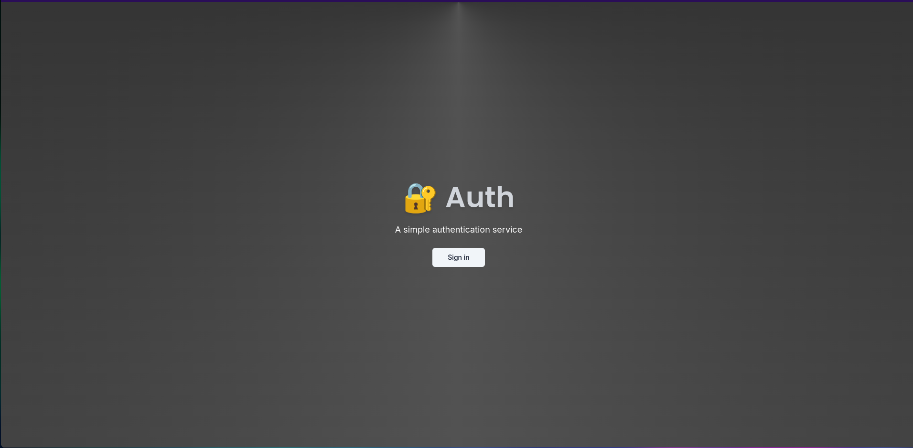
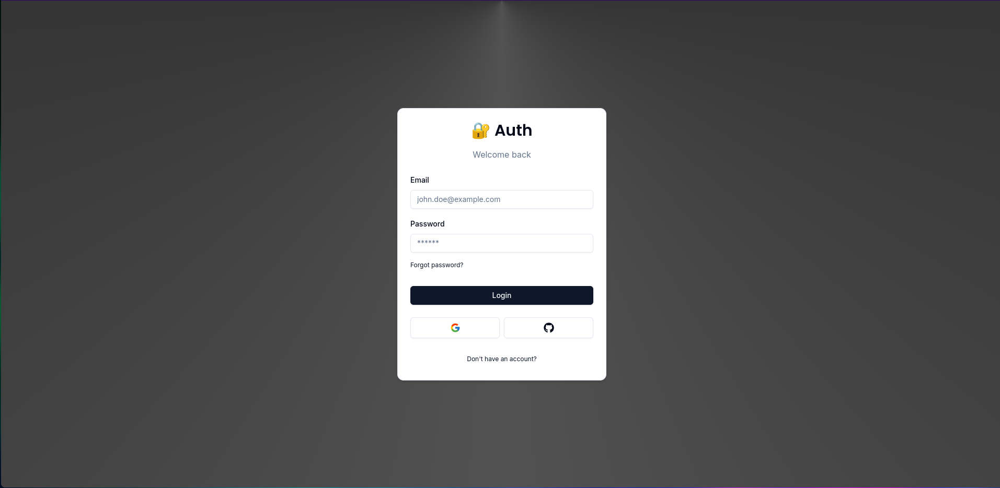
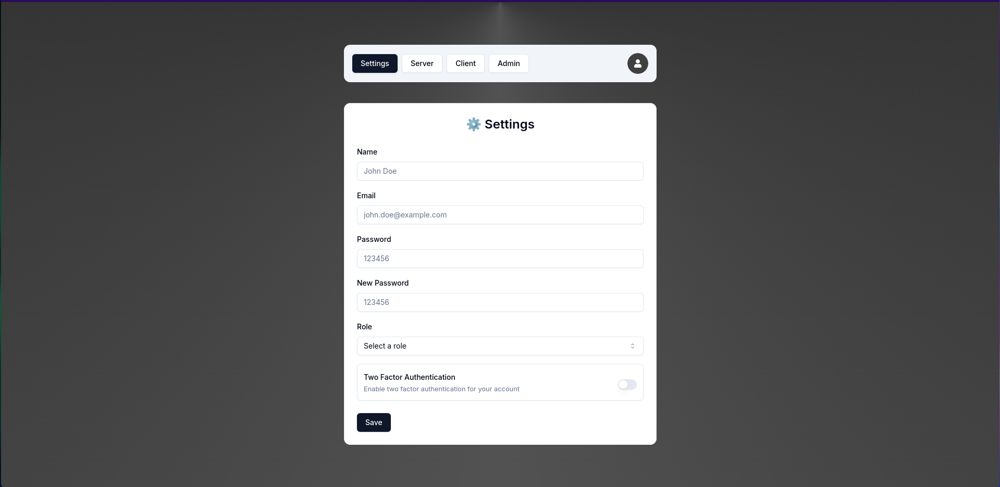
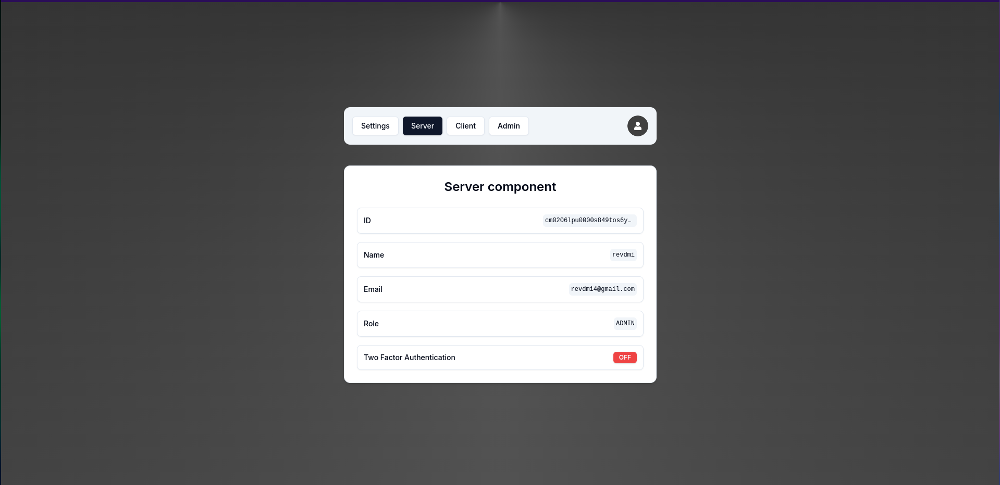
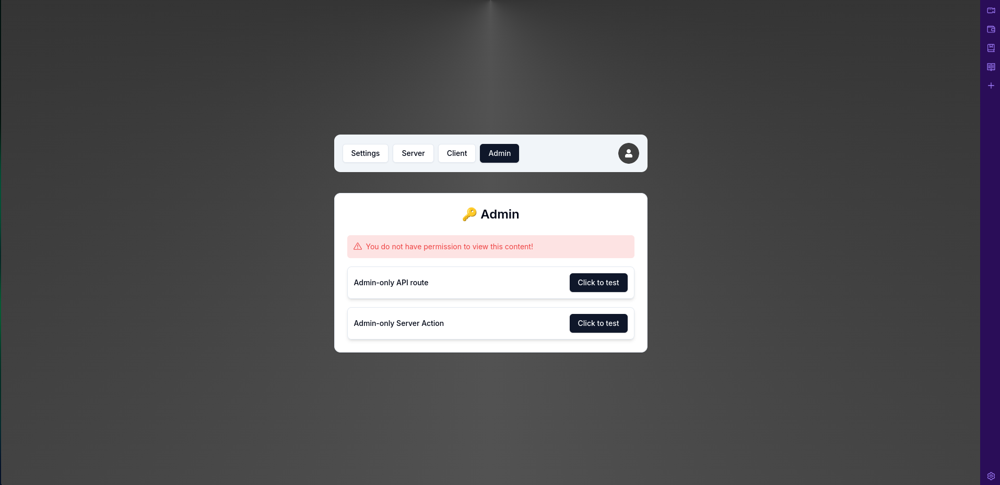

# AuthSwiss

**AuthSwiss** is a authentication toolkit designed to streamline the integration of robust and secure authentication systems in Next.js applications. AuthSwiss offers a ready-to-use template that covers essential authentication features. This toolkit is highly customizable.

> currently only designed for desktop view

## Features

- **🔐 NextAuth v5 (Auth.js):** Seamless integration with NextAuth.js for easy and flexible authentication.
- **🌐 OAuth-Based Login/Register:** Supports popular OAuth providers like Google and GitHub for quick and secure login and registration.
- **🔒 Forgot Password Functionality:** Users can easily reset their passwords via a secure email link.
- **✉️ Email Verification:** Verifies users' email addresses during registration to ensure the validity of their contact information.
- **📱 Two-Factor Authentication (2FA):** Adds an additional layer of security by requiring a second form of verification.
- **👥 Role-Based Authorization:** Differentiates access levels with roles like Admin and User, ensuring that only authorized users can access sensitive areas.
- **📧 Change Email:** Users can update their email addresses, with verification sent to the new address to confirm the change.
- **🔑 Change Password:** Users can change their passwords securely by confirming their current password.
- **🔔 Enable/Disable 2FA:** Users can manage their two-factor authentication settings from the Settings page.
- **🔄 Change User Role:** (Development Feature) Change user roles directly from the Settings page for testing and development purposes.

## Routes

- **/auth/login:** User login page.
- **/auth/register:** User registration page.
- **/settings:** User settings page for managing account details.
- **/admin:** Admin dashboard for managing users and roles.
- **/server:** Server-side rendered pages or actions.
- **/client:** Client-side rendered pages or actions.

## Installation

1. **Clone the Repository:**

   ```bash
   git clone https://github.com/jignesh119/AuthSwiss.git
   cd authswiss
   ```

2. **Install Dependencies:**

   ```bash
   npm install
   ```

3. **Environment Variables:**

   Create a `.env.local` file at the root of the project and add your environment variables:

   ```plaintext
   NEXT_PUBLIC_APP_URL=http://localhost:3000
   DATABASE_URL=your-database-url
   AUTH_EMAIL=your-email@example.com
   AUTH_PASSWORD=your-gmail-app-password
   GOOGLE_CLIENT_ID=your-google-client-id
   GOOGLE_CLIENT_SECRET=your-google-client-secret
   GITHUB_CLIENT_ID=your-github-id
   GITHUB_CLIENT_SECRET=your-github-secret
   AUTH_SECRET=secret-to-verify-authentication
   ```

4. **Run the Development Server:**

   ```bash
   npm run dev
   ```

   The app should now be running at [http://localhost:3000](http://localhost:3000).

## Usage

- **Authentication:** Visit `/auth/login` to log in or `/auth/register` to create a new account.
- **Settings Management:** Access `/settings` to update email, password, and manage two-factor authentication.
- **Admin Access:** The `/admin` route is restricted to users with the Admin role and provides a dashboard for managing users.
- **Server/Client Routes:** Use `/server` for server-side functionalities and `/client` for client-side interactions.

## Contributing

Feel free to fork the repository, create a new branch, and submit a pull request.

1. Fork the Project
2. Create your Feature Branch (`git checkout -b feature/AmazingFeature`)
3. Commit your Changes (`git commit -m 'Add some AmazingFeature'`)
4. Push to the Branch (`git push origin feature/AmazingFeature`)
5. Open a Pull Request

## Demo






